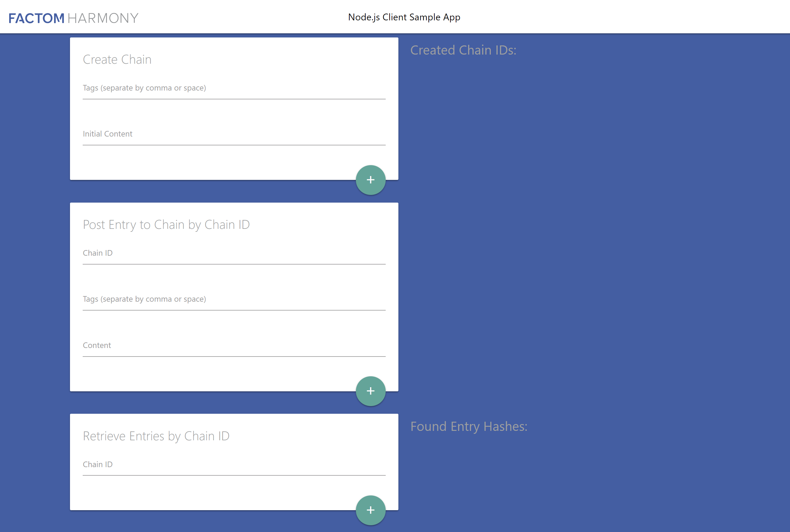

# Factom Harmony Connect Node Client Sample App

This is a sample application showcasing connectivity to the Factom Harmony Connect Node.js Client Library which can be found [here](https://github.com/FactomProject/factom-harmony-connect-node-client "Factom Harmony Connect Node.js Client Library").




## Getting Started

```bash
> git clone https://github.com/FactomProject/factom-harmony-connect-node-client-SampleApp.git
> cd factom-harmony-connect-node-client-SampleApp
> npm install
```

- Sign up for a free account at [account.factom.com](https://account.factom.com/login) and create an application on the Shared Sandbox - FREE plan. 
- Grab your Application ID and an Application Key.
- Create a file named .env in the root folder of the project and add the following two lines, your .env file should look like the example below.

```
REACT_APP_HARMONY_APPLICATION_ID=
REACT_APP_HARMONY_APPLICATION_KEY=
```

- Add your newly created crendtials to the .env file found in the root directory of the project. NO quotation marks are needed like in the example below.

```
// The id and key below are examples and invalid

REACT_APP_HARMONY_APPLICATION_ID=ae12538568
REACT_APP_HARMONY_APPLICATION_KEY=166136afssdsdfdf9ff72fa1b656c5ab3sdf1
```

- From the root folder of the project run.

```bash
> npm start
```
